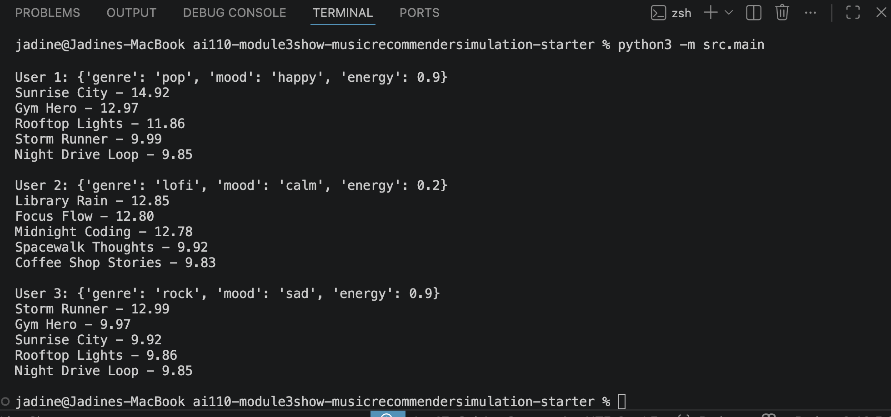

# 🎵 Music Recommender Simulation

## Project Summary

This project is a simple music recommender that suggests songs based on user preferences like genre, mood, and energy. Each song gets a score based on how well it matches the user, and then the songs are ranked from best match to worst.

---

## How The System Works

Each song has features like genre, mood, and energy. The user profile stores their preferred genre, mood, and energy level.

The system compares each song to the user’s preferences. It adds points if the genre and mood match, and also checks how close the energy level is.

After scoring all the songs, it sorts them and returns the top matches.

---

## Getting Started

### Setup

1. Create a virtual environment (optional but recommended):

   ```bash
   python -m venv .venv
   source .venv/bin/activate      # Mac or Linux
   .venv\Scripts\activate         # Windows

2. Install dependencies

```bash
pip install -r requirements.txt
```

3. Run the app:

```bash
python -m src.main
```

### Running Tests

Run the starter tests with:

```bash
pytest
```

You can add more tests in `tests/test_recommender.py`.

---

## Experiments You Tried

- Tried different user profiles and saw results change  
- Energy, genre, and mood had the biggest impact  
- Some songs repeated, so not very diverse  

---

## Stress Test Results



---

## Limitations and Risks

- Small dataset  
- Simple scoring system  
- Can repeat similar songs  
- Doesn’t learn over time  

---

## Reflection

Building this helped me understand how recommendation systems turn simple data into a score and then rank results. Even with just a few features like genre, mood, and energy, the system can still make reasonable suggestions.

It also showed how bias can happen easily. The system tends to repeat similar songs and doesn’t give much variety, which could lead to a filter bubble. The results depend a lot on the user input, so some genres or styles can be overrepresented.
